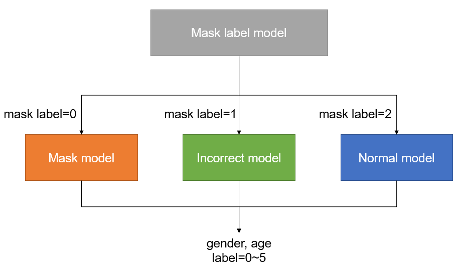

# README

## 1. 프로젝트 개요

* 사람의 마스크 착용 여부와 나이, 성별을 판별하는 모델 설계.

## 2. 목표 및 초기 구상

### 개인 목표

- baseline 코드를 바탕으로 AI 프로젝트의 구조를 이해하여 직접 원하는 내용을 구현 및 수정할 수 있게 되는 것.
- 성능 개선을 위한 다양한 관점을 경험해보고 이해하는 것.

### 초기 구상

* 마스크 착용 여부에 따라 나이, 성별을 판별하는 모델을 각각 학습.

## 3. 실험 및 결과

### 3.1. 다양한 parameters 시도

* model : ResNet18, GoogLeNet
* pretrained model parameter freeze : True, False
* batch size : 32, 64
* loss : CE (cross entropy), F1 (F1 score), CE+F1
* lr scheduler : CosineAnnealingLR
* optimizer : Adam
* epochs : 20

* 모델 4개를 따로 학습하기에 시간이 상대적으로 오래 걸림.
* baseline 코드를 수정하는데 시간이 많이 소모.
* 기존에 팀원들이 공유한 괜찮은 모델과 파라미터들을 중심으로 사용.
* 제출 결과.
  * `ResNet18 + CE + 64 batchs + unfreeze`
    * acc : `76.4286` , f1 : `0.6811`
  * `GoogLeNet + CE + 64 batchs + unfreeze`
    * acc : `77.0794` , f1 : `0.6918`
* ResNet18과 GoogLeNet 모두 전반적으로 비슷한 validation 결과를 모임.
* 그나마 가장 높게 나온 CE + 64 batchs + unfreeze의 조건으로 두 모델 결과를 test.
* GoogLeNet이 약간 더 높은 성능을 보였다.

### 3.2. train data augmentation

* VGG 논문에서 다양한 scale의 데이터를 학습 시, 성능이 향상된다는 것을 읽은 적이 있음.
* 위에서 가장 나은 성능을 보인 `GoogLeNet + CE + 64 batchs + unfreeze`로 실험.
* normal과 incorrect의 학습 데이터를 augmentation을 통해 그 양을 늘려줌.
* train loop에서 모델에 학습하기 직전에 augmentation된 데이터를 추가해줌.
* 양이 4~5배정도 늘어나므로, batch size는 16으로 줄임.  (한 번에 처리되는 양을 줄임.)
* augmentation 시도
  1. GaussNoise (std = 0.1, 0.2, 0.3)
  2. CenterCrop(384x384, 224x224), Resize(256x192), Centercrop(384x384)->Resize(192x192)
  3. 2번 + GaussianNoise(std=random(0.2, 0.4, 0.6, 0.8, 1.0))
  4. 3번 + ColorJitter(0.2, 0.2, 0.2, 0.2)
  5. 2번 + ColorJitter(0.2, 0.2, 0.2, 0.2)
* incorrect는 눈에 띄는 성능 향상 없음.
* normal은 2번에서 약간의 성능 향상을 보임. (val acc : 82.38 -> 84.22)

### 3.3. evaluation dataset 및 코드 작성

* 4개의 모델을 결합하므로, 각 모델의 validation 결과 외에는 성능 확인의 방법이 제출 밖에 없음.
* 제출 횟수가 제한되어 있으므로, 너무 비효율적.
* 가장 간단하게 train dataset에서 일정 비율을 랜덤하게 뽑아내어 evaluation을 하는 코드를 작성.
* 하지만 train dataset에서 뽑은 데이터라 성능이 매우 높게 나옴. 

### 3.4. TTA

* 예측 시, 입력 데이터를 원본과 center crop한 이미지로 TTA 수행.
* 위에서 작성한 evaluation으로는 TTA의 여부가 성능에 영향을 미치지 않는 것으로 보임.

### 3.5. 60대 데이터 늘리기

* 60대의 데이터를 임의로 (copy) 증가시키니 성능이 향상되었다는 팀원의 이야기를 듣고 시도.
* 58~59세를 모두 60세로 변경.
* 그 후, 60세 데이터를 2배로 복사.
* 전체적으로 60세 데이터가 약 2배 정도 증가.
* 팀원의 이야기로는 데이터 밸런스를 맞춘 뒤, 크기가 큰 모델에서 학습을 하니 성능이 많이 향상되었다 함.
* 하지만 시간 부족으로 GoogLeNet으로 시도.
* 제출 결과
  * acc : `77.0794 → 76.1905`, f1 : `0.6918 → 0.7144`
* acc는 감소했지만, f1 score가 유의미하게 증가함.
* 큰 모델로 시도할 시간이 부족했던 것이 아쉬움.

## 4. 결론

- 학습 데이터의 balance가 생각보다 성능에 미치는 영향이 컸다.
- 따로 학습한 여러 개의 모델을 사용하는 것은 단일 모델을 사용한 다른 팀원들의 결과와 비교하면 전반적으로 무난한 성능을 보였지만, 성능 향상을 위해서는 고려해야할 부분이 많은 것 같다.
